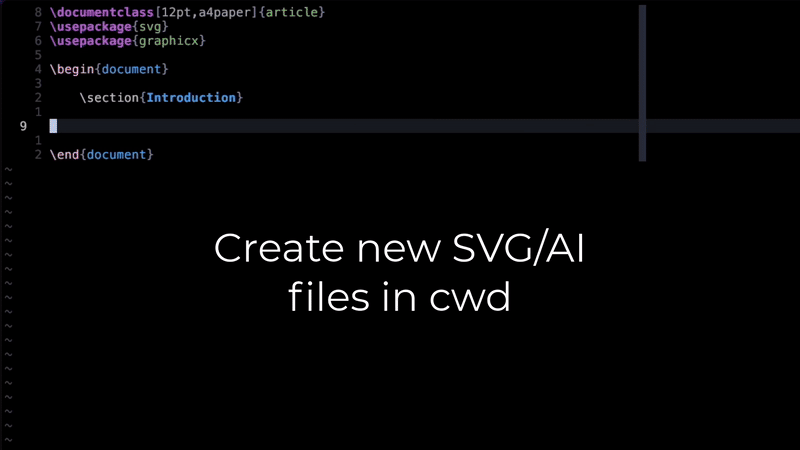

<h1 align="center">🎨 Illustrate</h1>

<p align="center">


Illustrate is a lua plugin for neovim that lets you quickly create, search 
and open vector files in Inkscape (Linux, macOS) and/or Adobe Illustrator (macOS) 
from within neovim. It works with LaTeX and Markdown files.



</p>

## Features

With key bindings you define, `illustrate` can:

* Create a new `.svg` file with a name of your choice, insert a code snippet
(for both latex and markdown) of the figure automatically, and open the figure in either
Inkscape or Adobe Illustrator. The example key binding provided below is
`<leader>is`.
* Create a new `.ai` file with a name of your choice, insert a code snippet (for
both latex and markdown) of the figure automatically, and open the figure in either Inkscape
or Adobe Illustrator. The example key binding provided below is `<leader>ia`.
* Open the figure under the cursor (if in LaTeX, it will work even if the cursor
is anywhere within a figure environment), in either Inkscape or Adobe
Illustrator. The example key binding below is `<leader>io`.
* By using [telescope](https://github.com/nvim-telescope/telescope.nvim), you can
search through the available `.svg` and `.ai` documents in your current working
directory and open them in Inkscape or Adobe Illustrator. The example key
binding below is `<leader>if`.
* By using [telescope](https://github.com/nvim-telescope/telescope.nvim), you can
search through the available `.svg` and `.ai` documents in your current working
directory, create a copy of one with a new name, and open the new copy in Inkscape or 
Adobe Illustrator. The example key binding below is `<leader>ic`.

The plugin currently supports macOS and Linux only, but I am open to add
support for Windows too. I am happy to accept merge requests on this matter, I 
just don't have a Windows machine to develop/test it.

## Installation

The plugin is currently designed for
[lazy.nvim](https://github.com/folke/lazy.nvim). However, I am open to
supporting other plugin managers as well (please feel free to open a pull
request).

### lazy.nvim

```lua
return { 
    'rpapallas/illustrate.nvim',
    dependencies = {
        "rcarriga/nvim-notify",
    },
    keys = function()
        local illustrate = require('illustrate')
        local illustrate_finder = require('illustrate.finder')

        return {
            {
                "<leader>is",
                function() illustrate.create_and_open_svg() end,
                desc = "Create and open a new SVG file with provided name."
            },
            {
                "<leader>ia",
                function() illustrate.create_and_open_ai() end,
                desc = "Create and open a new Adobe Illustrator file with provided name."
            },
            {
                "<leader>io",
                function() illustrate.open_under_cursor() end,
                desc = "Open file under cursor (or file within environment under cursor)."
            },
            {
                "<leader>if",
                function() illustrate_finder.search_and_open() end,
                desc = "Use telescope to search and open illustrations in default app."
            },
            {
                "<leader>ic",
                function() illustrate_finder.search_create_copy_and_open() end,
                desc = "Use telescope to search existing file, copy it with new name, and open it in default app."
            },
        }
    end,
    opts = {
        -- optionally define options.
    },
}
```

The default options (that you can override in `opts`) are:

```lua
illustration_dir = "figures",
template_files = { -- Templates used when new vector documents are created.
    -- You can optionally define a path to your own template dir and
    -- bootstrap your documents with a better template than an empty 
    -- canvas. 
    directory = {
        svg = templates_dir .. "/svg/",
        ai = templates_dir .. "/ai/",
    },
    default = {
        svg = "default.svg",
        ai = "default.ai",
    }
},
text_templates = { -- Default code template for each vector type (svg/ai) and each document (tex/md)
    svg = {
        tex = [[
\begin{figure}[h]
  \centering
  \includesvg[width=0.8\textwidth]{$FILE_PATH}
  \caption{Caption}
  \label{fig:}
\end{figure}
            ]],
        md = "",
    },
    ai = {
        tex = [[
\begin{figure}[h]
  \centering
  \includegraphics[width=0.8\linewidth]{$FILE_PATH}
  \caption{Caption}
  \label{fig:}
\end{figure}
            ]],
        md = "",
    }
},
default_app = { -- default software to use for opening ai/svg files.
    svg = "inkscape", -- Options: inkscape/illustrator
    ai = "inkscape", -- Options: inkscape/illustrator
},
```

## Using `.svg` and `.ai` files directly in LaTeX

You can use `.svg` file directly in LaTeX given that you have inkscape 
installed. You can then use `\includesvg[\linewidth]{figures/figure.svg}`.
Make sure to include `--shell-escape` when you compile 
(e.g. `lualatex --shell-escape main.tex ...`).

To use `.ai` files directly, however, you need to put the following line in your
LaTeX project:

```tex
\DeclareGraphicsRule{.ai}{pdf}{.ai}{}
```

then you can include it like so: `\includegraphics[\linewidth]{figures/figure.ai}`.

## Contributions, feedback and requests

Happy to accept contributions/pull requests to extend and improve this simple 
plugin. I am also open to feedback and requests for new features. Please open a 
GitHub issue for those.

## Other notes

* This is my first neovim plugin and the first time I write a lua code (any feedback is appreciated).
* This plugin is inspired from [this](https://github.com/gillescastel/inkscape-figures) Python project from [Gilles Castel](https://github.com/gillescastel) and his excellent blog post [here](https://castel.dev/post/lecture-notes-2/), but extended to support Adobe Illustrator on top of Inkscape and be a native lua plugin for neovim.
* The structure of this repo is based on [nvim-plugin-template](https://github.com/mistricky/nvim-plugin-template)

